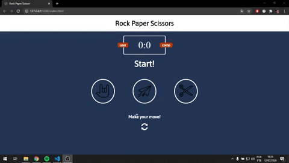

<h1 align="center">
   Simple Rock Paper Scissors
</h1>

 

## :camera: Ilustrações

## :rocket: Tecnologias

✔️Javascript

✔️HTML5

✔️CSS3

## 💻 Projeto

Simple Rock Paper Scissors é uma aplicação web, desenvolvida para iniciar o aprendizado em JS,CSS,HTML.
Desenvolvida através do canal freeCodeCamp.org no Youtube. Acesso em 12/07/2020 [link to video here](https://www.youtube.com/watch?v=jaVNP3nIAv0&t=25s)

## ⚙ Configuração

1- Para instalar o ambiente:

> Download VisualStudioCode

2- Preparar a aplicação:

> Dica: Utilizar a extensão Live Server

---

